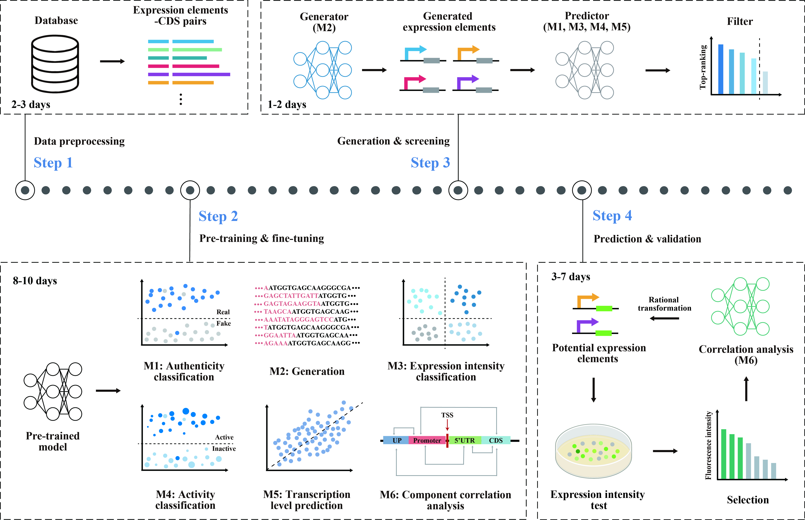

# BERT-PRISM: A Large-Scale Pretrained Model for Prokaryotic Expression Elements Recognition, Intensity, Synthesis, and Modulation




## 🔭Overview
**BERT-PRISM** is a pre-trained model specifically designed for prokaryotic promoters. This model was further fine-tuned on traditional prokaryotic pre-trained models (e.g., [DNABERT-2](https://github.com/MAGICS-LAB/DNABERT_2)) using over **30 million** promoter sequences. It not only outperforms DNABERT-2 on various specific downstream tasks, but also surpasses the model trained from scratch. Furthermore, we have developed an integrated workflow based on this model to efficiently screen highly-expressive artificial promoter sequences and validate their performance by experiments.


## 🎯Quick Start

### Dependencies
* Clone this repo, cd into it
```shell
git clone https://github.com/Hongxuan-Wu/bert_prism.git
cd bert_prism
```

* Install requirements with Python 3.8 and [PyTorch](https://pytorch.org/get-started/previous-versions/) 1.13.1. We prefer to create a [conda](https://www.anaconda.com/docs/getting-started/miniconda/main) environment to manage all packages.
```shell
conda create -n bertprism python=3.8
conda activate bertprism

conda install pytorch==1.13.1 torchvision==0.14.1 torchaudio==0.13.1 pytorch-cuda=11.7 -c pytorch -c nvidia
```

* Install additional packages as instructed:
```shell
pip install -r requirements.txt
```


### Datasets and Models
All models and datasets for the demo are now available on [Hugging Face](https://huggingface.co/datasets/Hongxuan-Wu/PED). 
```shell
# Extract the dataset
tar -zxvf bert_prism_data.tar.gz
```


### Pre-train
Coming soon...


### Downstream
To run the downstream tasks, you need to set the path and modify the mode to 'test'.
```python
# Modify the path of the models and data
config['root'] = '/xxx/bert_prism_data/'

# Set the mode as 'test'
config['mode'] = 'test'
```
Then, you can quickly verify each downstream task, and the results are saved in the './results' folder.
```python
# Authenticity classification
python 1train/authenticity_cls/main.py

# Transcript level classification
python 1train/transcript_level_cls/main.py

# Transcript level prediction
python 1train/transcript_level_pred/main.py

# Generation
python 1train/generation/main.py
```


### Prediction
Use the existing model to generate the target sequence and make a preliminary determination. Then, use the blast tool to perform genomic alignment on the generated sequence. Access [NCBI](https://blast.ncbi.nlm.nih.gov/doc/blast-help/downloadblastdata.html) to download the latest version of the blast tool, or click here ([blast-2.16.0+-x64-linux.tar.gz](https://ftp.ncbi.nlm.nih.gov/blast/executables/blast+/LATEST/ncbi-blast-2.16.0+-x64-linux.tar.gz)).

```bash
# Extract the blast tool
tar -zxvf ncbi-blast-2.16.0+-x64-linux.tar.gz

# Modify paths
root_dir = '/xxx/bert_prism_example/'
blast_dir = '/xxx/ncbi-blast-2.16.0+/'

# Run
python 2select/main.py
```
We integrate the results of these two parts, determine some sequences and conduct wet experiments for verification. 


## 📚 Datasets
* [PED](https://huggingface.co/datasets/Hongxuan-Wu/PED)


## 🤝Contact
If you have any questions, please raise an issue or contact us at walter_hx@163.com.


<!-- ## 📜 Citation
If you find this work useful, please cite our paper:
```
@article{
    huang2021prism,
    title={BERT-PRISM: A Large-Scale Pretrained Model for Prokaryotic Expression Elements Recognition, Intensity, Synthesis, and Modulation},
    author={},
    journal={},
    year={2021}
} -->
