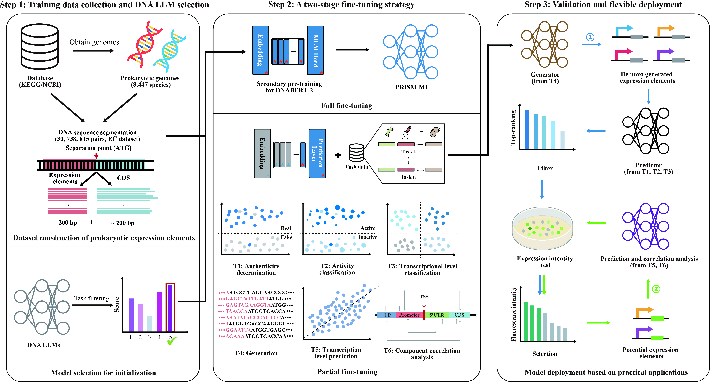

# PRISM: A deep learning framework for prokaryotic expression element recognition, intensity, synthesis, and modulation based on DNA large language model




## 🔭Overview
**PRISM** is a practical framework based on existing DNA LLMs (e.g., [DNABERT-2](https://github.com/MAGICS-LAB/DNABERT_2)) and combined a two-stage fine-tuning strategy for prokaryotic expression elements. Full fine-tuning based on **30 million** sequences collected from **8,447** prokaryotic species was employed to endow DNABERT-2 with prior knowledge of prokaryotic expression elements. Next, partial fine-tuning was further used to quickly build multiple downstream tasks models including authenticity determination, transcription level classification, de novo expression element generation, transcription level prediction, and component correlation analysis. Lastly, multiple downstream tasks were tested by wet experiments in model and non-model prokaryotes. This study highlights the broad applicability of the PRISM framework for prokaryotic expression elements and its potential in advancing synthetic biology.


## 🎯Quick Start

### Dependencies
* Clone this repo, cd into it
```shell
git clone https://github.com/Hongxuan-Wu/prism.git
cd prism
```

* Install requirements with Python 3.8 and [PyTorch](https://pytorch.org/get-started/previous-versions/) 1.13.1. We prefer to create a [conda](https://www.anaconda.com/docs/getting-started/miniconda/main) environment to manage all packages.
```shell
conda create -n prism python=3.8
conda activate prism

conda install pytorch==1.13.1 torchvision==0.14.1 torchaudio==0.13.1 pytorch-cuda=11.7 -c pytorch -c nvidia
```

* Install additional packages as instructed:
```shell
pip install -r requirements.txt
```


### Datasets and Models
All models and datasets for the demo are now available on [Hugging Face](https://huggingface.co/datasets/Hongxuan-Wu/PED). 
```shell
# Extract the dataset
tar -zxvf prism_data.tar.gz
```


### Testing
* To run the downstream tasks, you need to set the path and modify the mode to **'test'**.
```python
# Modify the path of the models and data
config['root'] = '/xxx/prism_data/'

# Set the mode as 'test'
config['mode'] = 'test'
```
* Then, you can quickly verify each downstream task, and the results are saved in the **'./results'** folder.
```shell
# Authenticity classification
python 1train/authenticity_cls/main.py

# Transcript level classification
config['num_class'] = 4  # 2 or 4
python 1train/transcript_level_cls/main.py

# Transcript level prediction
python 1train/transcript_level_pred/main.py

# Component correlation analysis
python 1train/component_correlation_analysis/main.py
```


### Prediction
* To predict the target sequence, first you need to perform the generation task and generate the target sequence. The default location for the output file **'gen_seqs.csv'** is in **'./results/predicts/'** folder.
```python
# Modify the path of the models and data
config['root'] = '/xxx/prism_data/'

# Generation
python 1train/generation/main.py
```
* Then you need to set the path and modify the mode to **'predict'** in each downstream task.
```python
# Modify the path of the models and data
config['root'] = '/xxx/prism_data/'

# Set the mode as 'predict'
config['mode'] = 'predict'

# Predict
python 1train/xxx/main.py
```

* Use the blast tool to perform genomic alignment on the generated sequence. Access [NCBI](https://blast.ncbi.nlm.nih.gov/doc/blast-help/downloadblastdata.html) to download the latest version of the blast tool, or click here ([blast-2.16.0+-x64-linux.tar.gz](https://ftp.ncbi.nlm.nih.gov/blast/executables/blast+/LATEST/ncbi-blast-2.16.0+-x64-linux.tar.gz)).

```shell
# Extract the blast tool
tar -zxvf ncbi-blast-2.16.0+-x64-linux.tar.gz

# Modify paths
root_dir = '/xxx/prism/'
blast_dir = '/xxx/ncbi-blast-2.16.0+/'

# Run
python 2select/main.py
```
We integrate the results of these two parts, determine some sequences and conduct wet experiments for verification. 


## 📚 Datasets
* EC, downstream datasets and supplementary data can be found on [huggingface](https://huggingface.co/datasets/Hongxuan-Wu/prism).


## 🤝Contact
If you have any questions, please raise an issue or contact us at hxwu97nnu@gmail.com.


<!-- ## 📜 Citation
If you find this work useful, please cite our paper:
```
@article{
    huang2021prism,
    title={PRISM: A deep learning framework for prokaryotic expression element recognition, intensity, synthesis, and modulation based on DNA large language model},
    author={},
    journal={},
    year={2021}
} -->
